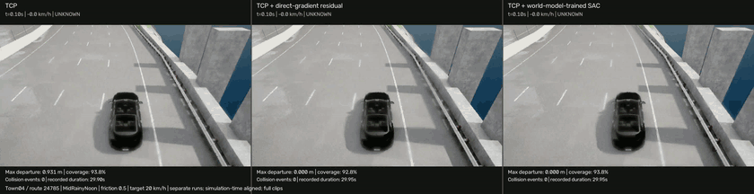
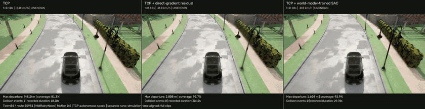
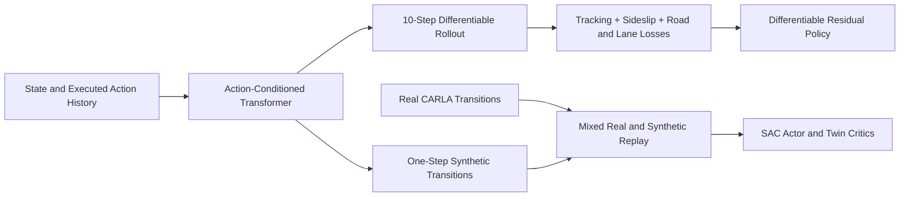

# World-Model-Assisted Residual Control for Autonomous Driving under Dynamics Shift

This project investigates whether learned dynamics can train a lightweight residual controller to adapt an existing driving policy to changes in vehicle dynamics, such as low friction, while keeping the base policy frozen.

Starting from a frozen TCP + PID driving policy, I add bounded residual actions to make small corrections to steering and longitudinal control. The project implements an action-conditioned Transformer dynamics model and compares two approaches to training residual policies with a world model:

Differentiable Residual Control — Feed candidate residual actions into the frozen world model, construct driving objectives from predicted future states, and optimize the residual policy by backpropagating through the dynamics model.

World-Model-Assisted SAC — Train SAC with real interaction experience and use the world model to generate additional model-based transitions to improve residual-policy training efficiency.

## Demo Results

[20 km/h three-way video](demo/videos/rain_speed20.mp4) · [Autonomous-speed collision-route video](demo/videos/rain_autonomous.mp4)

**Rainy weather · 20 km/h: TCP / Direct Residual / WM-SAC**



**Rainy weather · Autonomous-speed collision route: TCP / Direct Residual / WM-SAC**



| Route / Mode | Controller | Outcome | Max Lane Departure |
|---|---|---|---:|
| 24785 / 20 km/h | TCP | Completed, no collision | 0.931 m |
| 24785 / 20 km/h | TCP + differentiable residual | Completed, no collision | 0.000 m |
| 24785 / 20 km/h | TCP + world-model-assisted SAC | Completed, no collision | 0.000 m |
| 25951 / autonomous speed | TCP | Collision | 9.810 m |
| 25951 / autonomous speed | TCP + differentiable residual | Completed, no collision | 2.008 m |
| 25951 / autonomous speed | TCP + world-model-assisted SAC | Completed, no collision | 1.604 m |

## Quick Start

```bash
conda env create -f environment.yml
conda activate wm_res_control
```

See the [setup guide](docs/SETUP.md) for CARLA installation and startup instructions.

After starting CARLA, reproduce the rainy collision route:

```bash
python evaluation/record_demo.py --output outputs/rain_collision
```

For the 20 km/h route:

```bash
python evaluation/record_demo.py --scenario speed20 --output outputs/rain_speed20
```

The demo uses the trained models in `demo/models/`.

## Download Data and Retrain

**Dataset: [Google Drive](https://drive.google.com/file/d/1jsaaDUzWepih2cwlcuvvtHdk_RpckVN8/view?usp=sharing).** Download `WM_Res_Control_Data.tar.gz`, place it in `data/`, and extract it from the project root:

```bash
tar -xzf data/WM_Res_Control_Data.tar.gz -C data
```

Train each model with its own command:

```bash
python training/train_world_model.py
python training/train_direct_residual.py
python training/train_sac_residual.py
```

| Model | Default Data | Default Output |
|---|---|---|
| Transformer world model | `data/prepared/world/` | `outputs/training/world/best.pt` |
| Differentiable residual policy | `data/prepared/direct/` | `outputs/training/direct/best.pt` |
| SAC residual policy | `data/prepared/sac/replay.pt` | `outputs/training/sac/actor.pt` |

The differentiable residual trainer uses the released `demo/models/world.pt` by default. To use a newly trained world model, add `--world outputs/training/world/best.pt`. SAC uses the synthetic experience already generated by the world model and included in the dataset.

See the [data collection and training instructions](docs/SETUP.md#6-world-model) for details.

## Method

See [Methods](docs/METHODS.md) for model details, loss functions, and reward design.



Both policies use the frozen world model during training. At deployment, each policy requires only a forward pass. The final control is:

```text
longitudinal_control = throttle - brake
executed_control = clip(TCP_base_control + residual, -1, 1)
steering_residual ∈ [-0.05, 0.05]; longitudinal_residual ∈ [-0.02, 0.02]
```

### Model Configuration and Prediction

| Component | Configuration |
|---|---|
| World model | 10 frames of 7-dimensional history plus the current candidate action; Transformer width 64, 2 layers, 4 attention heads; predicts the next state and local motion increments |
| Differentiable residual policy | Holds the current TCP base action over a 10-step rollout and updates the residual as the predicted state evolves |
| World-model-assisted SAC | Twin critics, target networks, automatic entropy tuning, and a tanh-squashed Gaussian actor; one-step synthetic predictions; 48 real and 16 synthetic transitions per batch |

## Repository Structure

```text
data/                      Collection and preparation entry points, dataset instructions
  raw/                     Raw recordings and historical replay snapshots (download)
  prepared/                Ready-to-train inputs for all three models (download)
  maps/                    Offline map geometry (download)
  collection/              Newly collected data (generated locally)
training/                  World model, differentiable residual, and offline SAC trainers
evaluation/                Recording, closed-loop evaluation, plots, and results
experiments/low_friction/   Core implementations used by the public entry points
demo/models/               Frozen TCP and the three trained models
demo/videos/               Comparison videos
docs/                      Setup guide, methods, and source information
outputs/                   New checkpoints and evaluation outputs (generated locally)
```

## References

- **Bench2Drive** — *Bench2Drive: Towards Multi-Ability Benchmarking of Closed-Loop End-To-End Autonomous Driving* (2024). [Paper](https://arxiv.org/abs/2406.03877) · [Code](https://github.com/Thinklab-SJTU/Bench2Drive)
- **TCP** — *Trajectory-guided Control Prediction for End-to-end Autonomous Driving: A Simple yet Strong Baseline* (2022). [Paper](https://arxiv.org/abs/2206.08129) · [Code](https://github.com/OpenDriveLab/TCP)
